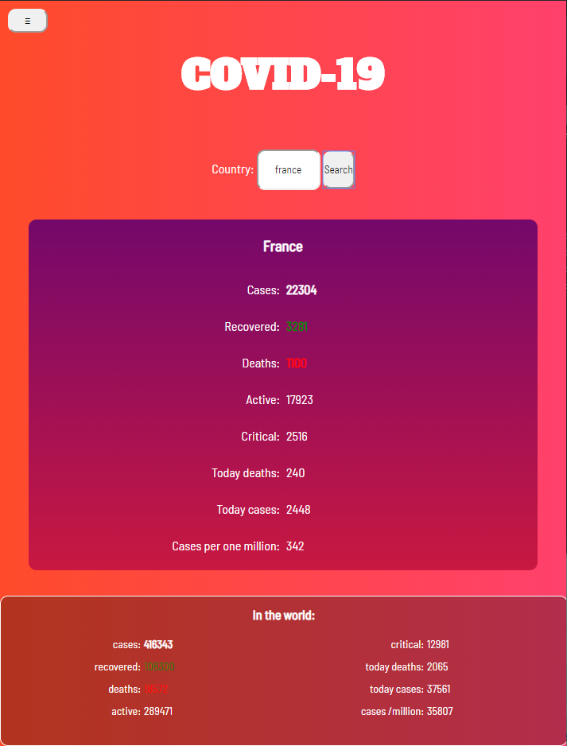

# Covid-app

Covid-app récupère les chiffres mondiaux de l'épidémie du coronavirus en temps réel et les affiche sur une page HTML.

Projet réalisé en **javascript**. Conversion en APK avec **cordova**.

